<div align="center">

# *"وَقُلْ رَبِّ زِدْنِي عِلْمًا"*

</div>
<br clear="both">
<a href="https://git.io/typing-svg"></a>
<br clear="both">

 Salety is a Flutter-based shopping app that allows users to browse products, add them to their cart, and manage their shopping experience. This README provides an overview of the app's setup and usage.

[](https://flutter.dev/)
[](https://opensource.org/licenses/MIT)

---
## Features

- User authentication and profile management
- Product browsing and categorization
- Shopping cart management
- Favorite products
- Localization support for Arabic (UAE)

---
## Screenshots

| 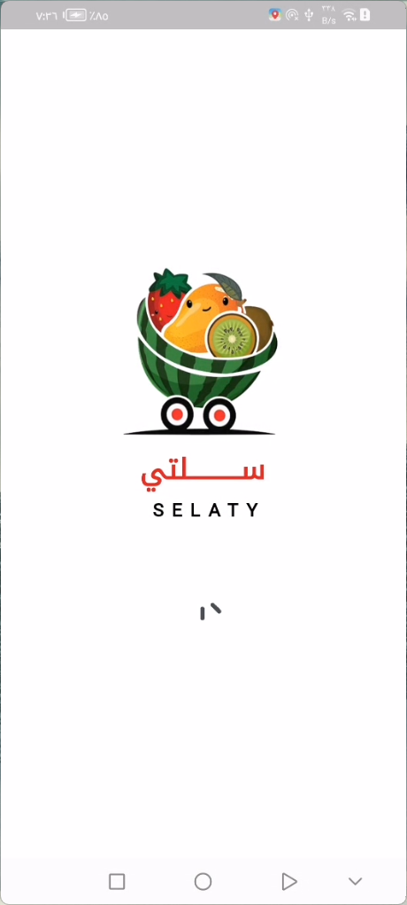 | 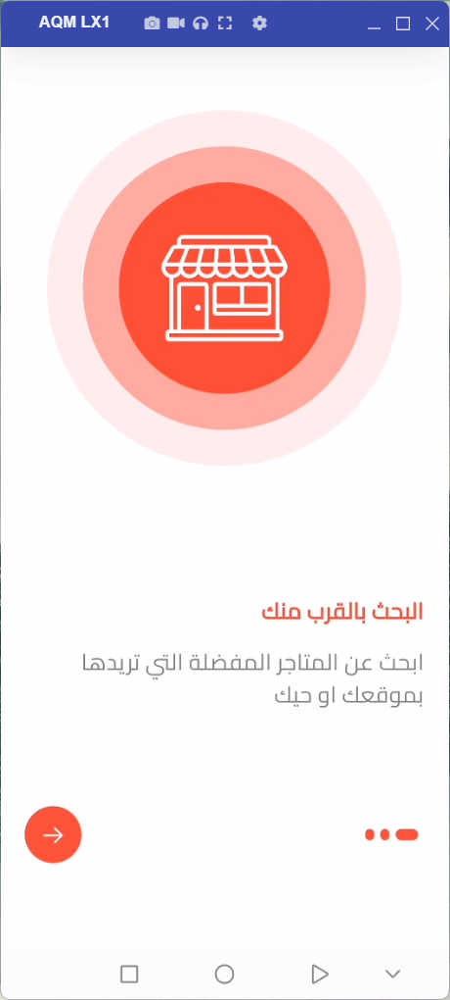 | 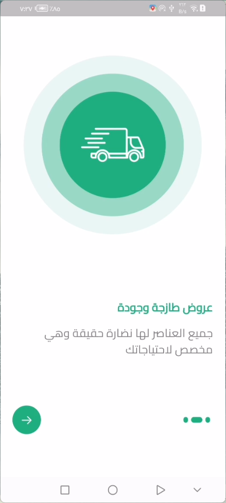  | 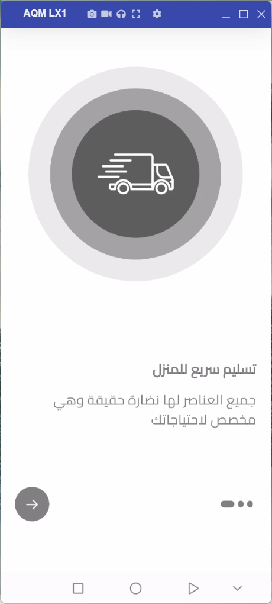  |
|---|---|---|---|
| 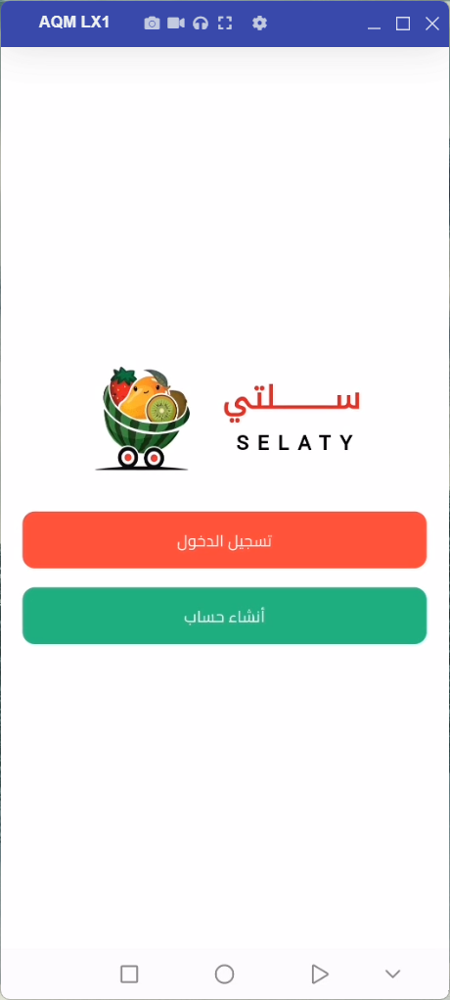 | 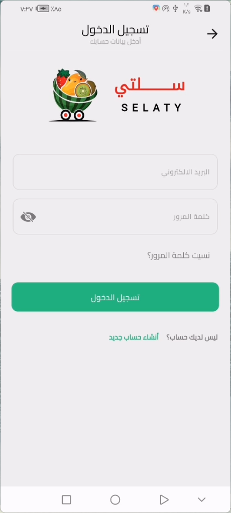 | 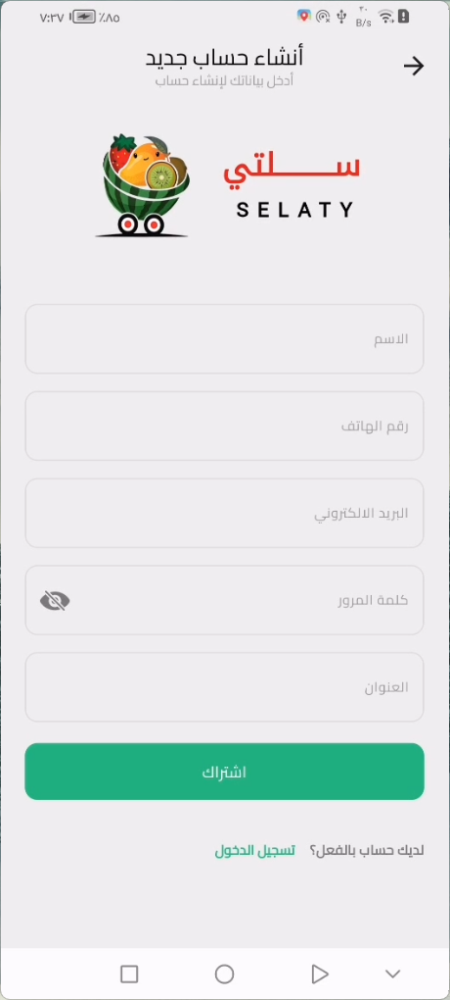  | 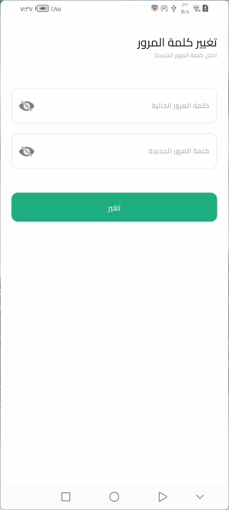  |
|---|---|---|---|
| 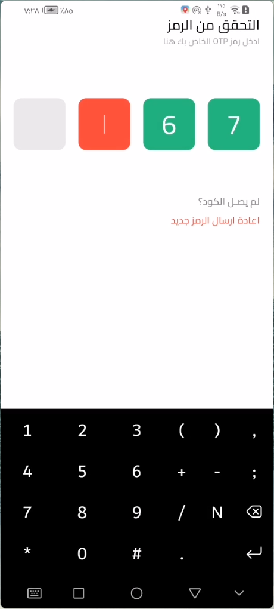 | 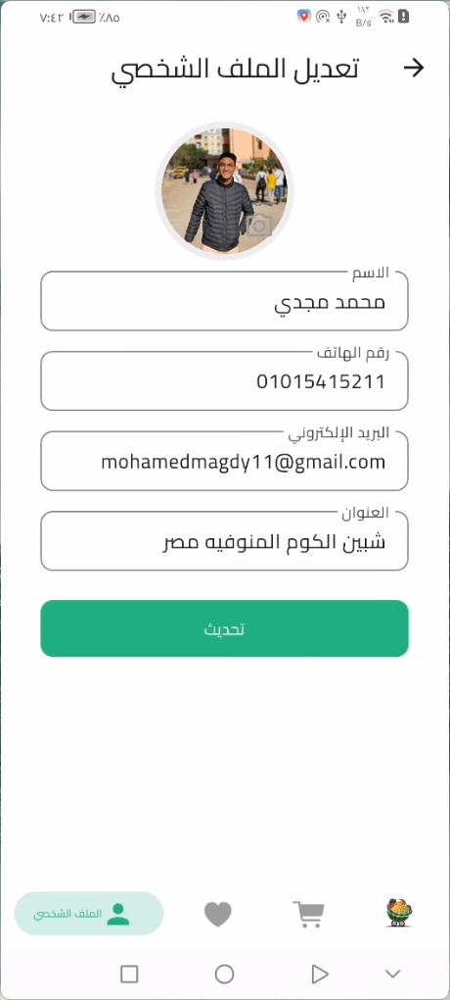 |   |   |
|---|---|---|---|
| 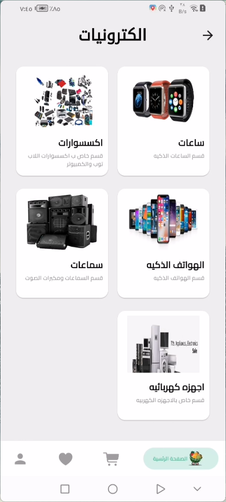 |  | 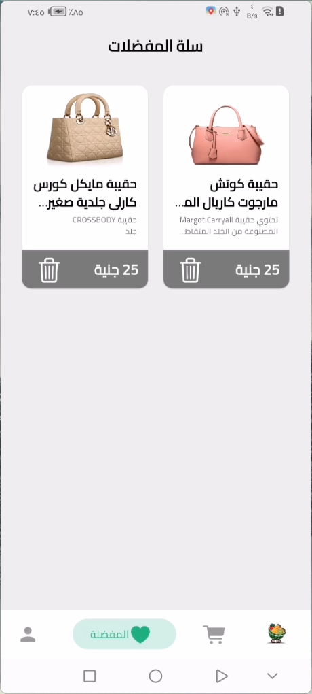  | 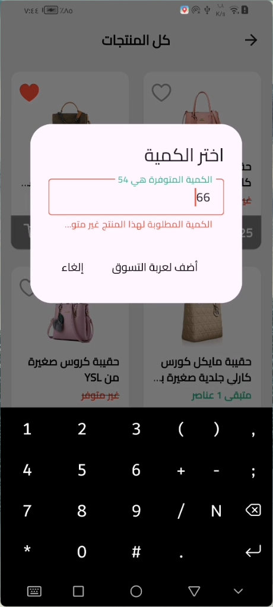  |
|---|---|---|---|
| 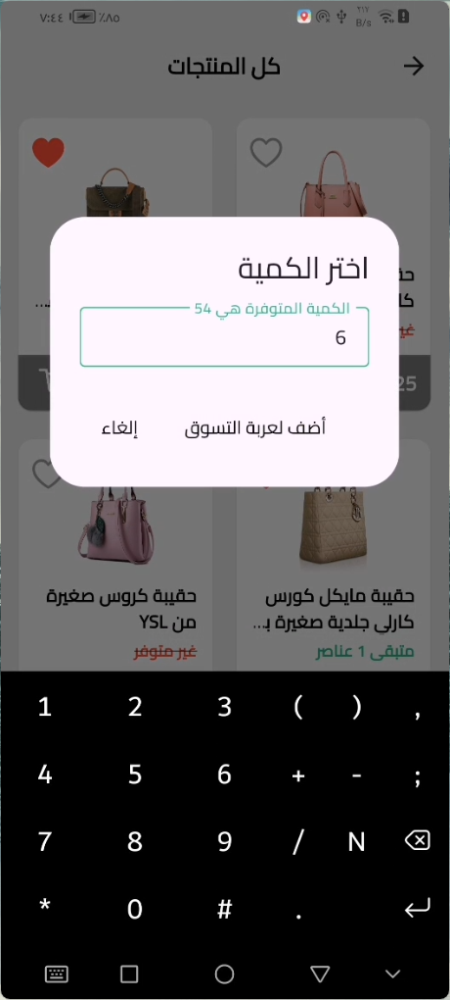 |  | 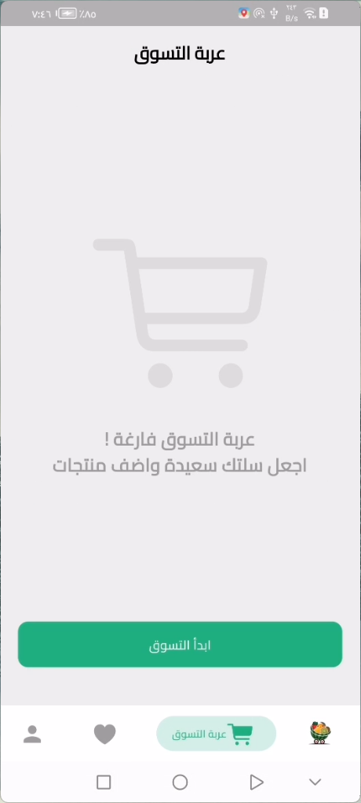  |   |
---

## Getting Started

### Prerequisites

- Flutter SDK: [Install Flutter](https://flutter.dev/docs/get-started/install)
- Hive: [Hive Database](https://pub.dev/packages/hive)
- Shared Preferences: [Shared Preferences](https://pub.dev/packages/shared_preferences)

### Installation

1. **Clone the repository**:

   ```sh
   git clone https://github.com/yourusername/selaty.git
   cd selaty
   ```

2. **Install dependencies**:

   ```sh
   flutter pub get
   ```

3. **Run the app**:

   ```sh
   flutter run
   ```

### Hive Setup

1. **Initialize Hive**:

   Ensure you initialize Hive in your main app file, typically in `main.dart`:

   ```dart
   void main() async {
     WidgetsFlutterBinding.ensureInitialized();
     await Hive.initFlutter();
     Hive.registerAdapter(AllCartUserModelAdapter());
     Hive.registerAdapter(CartUserModelAdapter());
     Hive.registerAdapter(ProductCartAdapter());
     await Hive.openBox<AllCartUserModel>(cartUsersBox);
     runApp(const SelatyApp());
   }
   ```

2. **Register Adapters**:

   Register the Hive adapters for your models:

   ```dart
   Hive.registerAdapter(AllCartUserModelAdapter());
   Hive.registerAdapter(CartUserModelAdapter());
   Hive.registerAdapter(ProductCartAdapter());
   ```

### Usage

1. **User Authentication**:

   The app supports user authentication and profile management. Ensure you have the necessary backend setup for user authentication.

2. **Product Browsing**:

   Users can browse products categorized into different sections. The `ProductsCubit` handles fetching and displaying products.

3. **Shopping Cart**:

   Users can add products to their cart, and the `CartCubit` manages the cart's state. The cart is saved using Hive for persistence.

4. **Favorite Products**:

   Users can mark products as favorites, managed by the `FavoriteProductCubit`.

5. **Localization**:

   The app supports Arabic (UAE) localization. Ensure your device or emulator is set to the appropriate locale.

### Project Structure

- `lib/core`: Core utilities and constants.
- `lib/features`: Feature-specific code, including data models, repositories, and view models.
- `lib/selaty app`: Main app entry point and configuration.

---

## Contributing

Contributions are highly encouraged! If you would like to contribute to `سلـــــــتى`, please follow these steps:

1. **Fork the Repository**.
2. **Create a New Branch**:
   ```bash
   git checkout -b feature/YourFeature
   ```
3. **Commit Your Changes**:
   ```bash
   git commit -m "Add your message"
   ```
4. **Push to the Branch**:
   ```bash
   git push origin feature/YourFeature
   ```
5. **Open a Pull Request**.

## Congratulations

You’ve successfully integrated `سلـــــــتى` App into your Flutter app! For more advanced features and customization options.

If you found this guide helpful, don’t forget to ⭐ star this repository on GitHub to show your support!

Thank you for reading!
## License

This project is licensed under the MIT License - see the [LICENSE](LICENSE) file for details.

## Contact

For any questions or inquiries, feel free to reach out:

- **GitHub:** [mohamedmagdy2301](https://github.com/mohamedmagdy2301)
- **Email:** [mohammedmego15@gmail.com](mohammedmego15@gmail.com)


